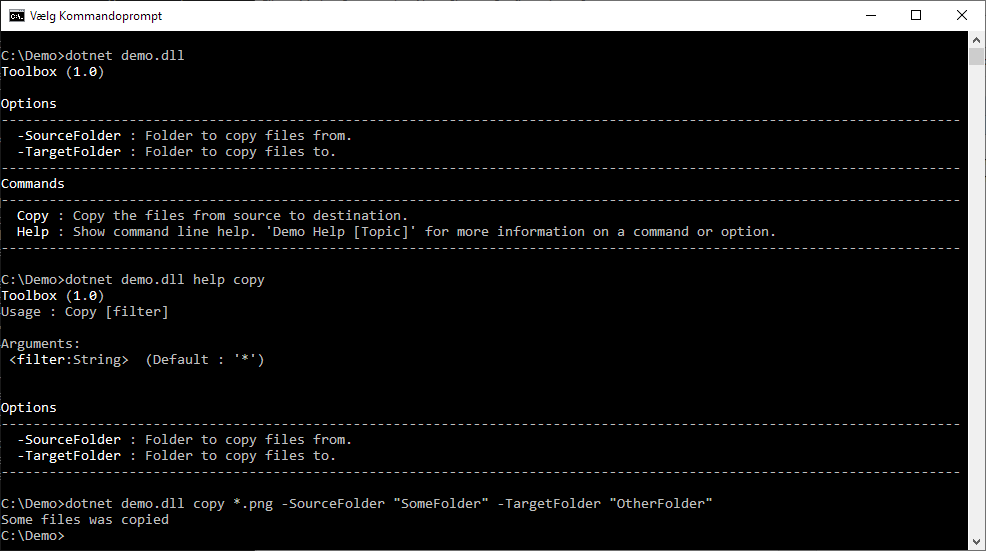

# ConsoleExtensions.Commandline

Wrap a toolbox object in a command-line interface in jus a few lines of code.

```csharp
    using ConsoleExtensions.Commandline;

    internal class Program
    {
        private static void Main(string[] args)
        {
            Controller.Run(new Toolbox());
        }
    }
```

Exampel Toolbox class

```csharp
    public class Toolbox
    {
        [Description("Folder to copy files from.")]
        public string SourceFolder { get; set; }

        [Description("Folder to copy files to.")]
        public string TargetFolder { get; set; }

        [Description("Copy the files from source to destination.")]
        public string Copy(string filter = "*")
        {
            /// your logic here
            return "Some files was copied";
        }
    }
```

Will give you a commandline interface with the following options.

- **dotnet demo.dll**  will display help
- **dotnet demo.dll Help copy**  will display help for the copy command
- **dotnet demo.dll Copy \*.png -SourceFolder "somePics" -TargetFolder "otherPics"** will invoke the copy method

